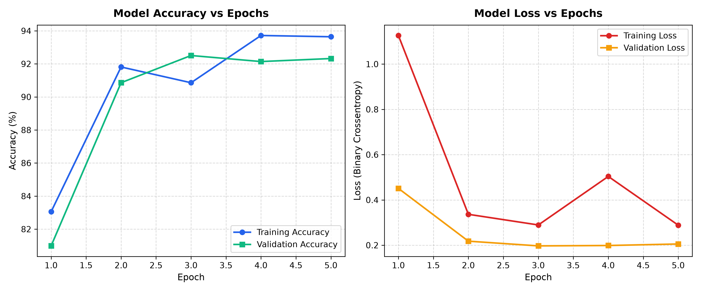
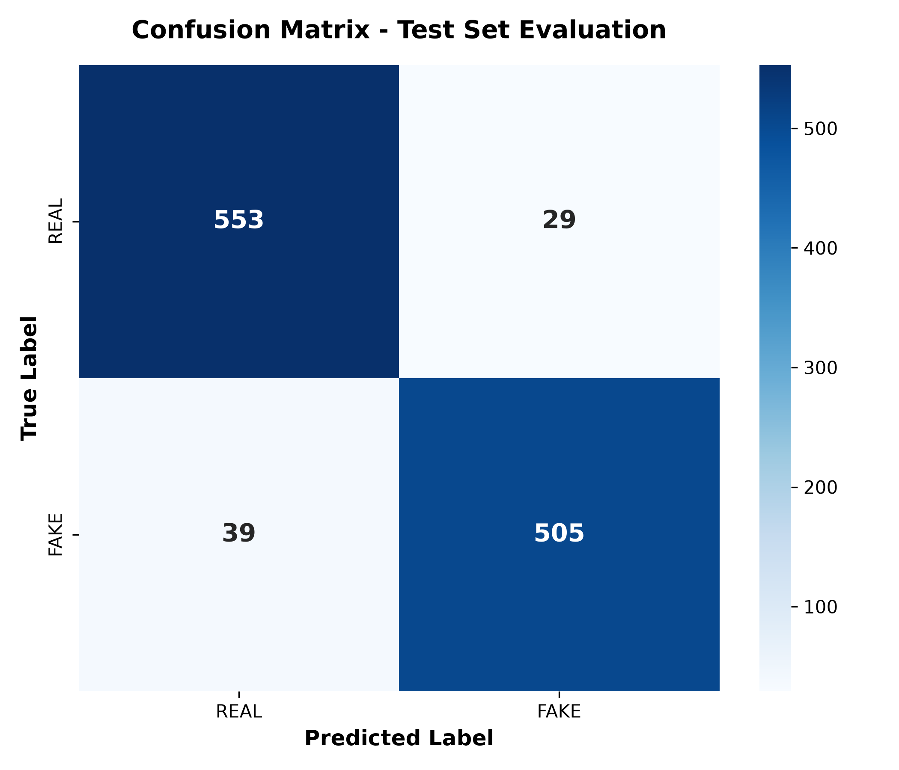

# Face Authenticity Classifier

> A deep learning Convolutional Neural Network (CNN) built to distinguish between real human faces and AI-generated deepfakes.


[Overview](#-overview) · [Features](#-key-features) · [Architecture](#️-system-architecture) · [Results](#-results) · [Visualizations](#-visualizations) · [Usage](#️-usage)

---

## Table of Contents

- [Overview](#-overview)
- [Objectives](#-objectives)
- [Problem Statement](#-problem-statement)
- [Proposed Solution](#-proposed-solution)
- [Key Features](#-key-features)
- [System Architecture](#️-system-architecture)
- [Project Workflow](#-project-workflow)
- [Technology Stack](#️-technology-stack)
- [Project Structure](#-project-structure)
- [Dataset](#-dataset)
- [Installation](#️-installation)
- [Usage](#️-usage)
- [Results](#-results)
- [Visualizations](#-visualizations)
- [Limitations](#️-limitations)
- [Future Enhancements](#-future-enhancements)
- [Contributors](#-contributors)
- [References](#-references)

---

## 📌 Overview

With the rapid advancement of generative AI, the ability to generate hyper-realistic fake images has increased dramatically. This project addresses the growing need for reliable image verification by implementing a custom CNN that classifies facial images as either **REAL** or **FAKE**. The system is evaluated not just on overall accuracy, but also on its robustness across predefined splits, varying demographic metadata (Gender, Age Groups), and image-quality difficulty tiers.

## 🎯 Objectives

1. Preprocess and analyze a facial image dataset, validating and filtering down to **5,556 viable images**.
2. Extract meaningful spatial and visual features from images using TensorFlow's `Conv2D` and `MaxPooling2D` layers.
3. Train a high-performing binary classification model using dataset-predefined train (3,883), validation (547), and test (1,126) splits.
4. Evaluate model performance using Accuracy, Precision, Recall, and F1-Score metrics on the hold-out test set.
5. Analyze the impact of demographic (gender, age groups) and image-quality attributes (detection difficulty, image quality) on classification performance.
6. Develop an end-user verification system (`predict.py`) that returns authenticity classification and confidence score percentages.

## 🚨 Problem Statement

The proliferation of AI-generated media poses significant risks to digital identity, security, and information integrity. Existing verification systems often struggle with sophisticated deepfakes or exhibit undetected biases against certain demographic groups, creating a need for transparent, reproducible, and rigorously evaluated classification models.

## 💡 Proposed Solution

A custom deep learning pipeline using TensorFlow/Keras that ingests raw facial images, standardizes pixel data, and trains a CNN to detect microscopic deepfake artifacts. The solution includes a dedicated metadata evaluation script to ensure the model maintains consistent performance across varying difficulty tiers, age categories, and gender demographics, paired with an interactive single-image verification tool.

## ✨ Key Features

- **Custom CNN Architecture** — optimized for binary classification of 128×128 RGB facial images
- **Predefined Data Splits** — strict evaluation on 3,883 training, 547 validation, and 1,126 testing samples
- **High Test Accuracy** — achieved **93.96%** accuracy and **94.57%** precision on the official holdout test set
- **Bias & Demographic Robustness** — multi-attribute evaluation across Gender, Age Groups, Image Quality, and Difficulty tiers
- **Single-Image Verification CLI** — `predict.py` script evaluating individual images with confidence score percentages
- **Automated Visual Reporting** — automated generation of training curves and confusion matrix plots

## 🏗️ System Architecture


## 🔄 Project Workflow


## 🛠️ Technology Stack

| Category | Technology |
|---|---|
| Programming | Python |
| Deep Learning | TensorFlow, Keras |
| Data Manipulation | Pandas, NumPy |
| Machine Learning & Metrics | Scikit-learn |
| Visualization | Matplotlib, Seaborn |
| Environment | Conda (`face_env`) |
| Version Control | Git & GitHub |

## 📂 Project Structure

```text
face-authenticity-classifier/
├── data/
│   ├── processed/         # Cleaned metadata CSVs (cleaned_metadata.csv)
│   └── raw/               # Raw images (5,556 images)
├── docs/                  # Architectural diagrams and generated evaluation plots
│   ├── architecture.png
│   ├── workflow.png
│   ├── training_curves.png
│   └── confusion_matrix.png
├── models/                # Saved trained CNN models (face_authenticity_cnn.keras)
├── reports/
│   └── figures/           # Exported publication-ready charts
├── src/
│   ├── download_images.py
│   ├── preprocess_data.py
│   ├── train_model.py
│   ├── evaluate_metadata.py
│   └── predict.py
├── notebooks/
│   └── 01_exploratory_data_analysis.ipynb
├── predict.py             # User verification tool (CLI)
├── requirements.txt
└── README.md
```

## 📊 Dataset

The project utilizes a curated dataset of facial images, filtered from 6,557 initial rows down to **5,556 validated images**. The dataset includes accompanying metadata (`cleaned_metadata.csv`) detailing labels (REAL vs. FAKE), gender demographics, age brackets, image quality indicators, and assigned detection difficulty.

- **Training Split:** 3,883 images (69.9%)
- **Validation Split:** 547 images (9.8%)
- **Testing Split:** 1,126 images (20.3%)

## ⚙️ Installation

**1. Clone the repository**

```bash
git clone https://github.com/alok-verma263/face-authenticity-classifier.git
cd face-authenticity-classifier
```

**2. Create and activate a Conda environment**

```bash
conda create -n face_env python=3.10
conda activate face_env
```

**3. Install the required dependencies**

```bash
pip install -r requirements.txt
```

## ▶️ Usage

Execute the pipeline in the following order using your active environment:

**1. Preprocess the data**

```bash
python src/preprocess_data.py
```

**2. Train the model and generate training curves**

```bash
python src/train_model.py
```
*Outputs: `models/face_authenticity_cnn.keras` and `docs/training_curves.png`.*

**3. Run the metadata and bias evaluation**

```bash
python src/evaluate_metadata.py
```
*Outputs: Detailed demographic metrics and `docs/confusion_matrix.png`.*

**4. Verify authenticity of single images (User Verification System)**

```bash
# Evaluate any custom facial image
python predict.py data/raw/images/image_1.jpg

# Or specify via the image flag
python predict.py --image path/to/face.jpg
```

Example CLI Output:
```text
============================================================
    AI FACE AUTHENTICITY VERIFICATION RESULT
============================================================
Target Image:      data/raw/images/image_1.jpg
Authenticity:      REAL (Authentic Face)
Confidence Score:  93.01%
------------------------------------------------------------
Authentic Prob:    93.01%
Manipulated Prob:  6.99%
============================================================
Status: [PASS] Image verified as an authentic human face.
```

## 📈 Results

### Overall Performance Metrics

Evaluation on the official holdout test set (**1,126 images**) demonstrates strong discrimination capability between authentic and synthetic faces:

| Metric | Holdout Test Set (Predefined) | Validation Set |
|---|---|---|
| **Accuracy** | **93.96%** | 92.32% |
| **Precision** | **94.57%** | 94.03% |
| **Recall** | **92.83%** | 90.65% |
| **F1-Score** | **93.69%** | 92.31% |

### Demographic & Metadata Robustness Breakdown

The model was subjected to slice-based evaluation across four key metadata dimensions:

#### 1. Age Group Demographics
| Age Group | Sample Count | Accuracy | Precision | Recall | F1-Score |
|---|---|---|---|---|---|
| **18–25** | 309 | 93.53% | 94.16% | 91.49% | 92.81% |
| **26–35** | 260 | 93.46% | 95.56% | 92.14% | 93.82% |
| **36–50** | 297 | 94.28% | 93.92% | 94.56% | 94.24% |
| **50+** | 260 | 94.62% | 94.74% | 93.10% | 93.91% |

#### 2. Image Quality Levels
| Quality | Sample Count | Accuracy | Precision | Recall | F1-Score |
|---|---|---|---|---|---|
| **High** | 755 | 93.77% | 94.02% | 92.70% | 93.35% |
| **Medium** | 371 | 94.34% | 95.63% | 93.09% | 94.34% |

#### 3. Detection Difficulty Tiers
| Difficulty Tier | Sample Count | Accuracy | F1-Score | Note |
|---|---|---|---|---|
| **Easy** | 582 | 95.02% | Baseline | Predominantly authentic samples |
| **Medium** | 180 | 93.89% | 96.85% | Balanced manipulation detection |
| **Hard** | 364 | 92.31% | 96.00% | High-fidelity synthetic artifacts detected |

#### 4. Gender Demographics
| Gender | Sample Count | Accuracy |
|---|---|---|
| **Female** | 217 | 86.64% |
| **Male** | 205 | 91.22% |
| **Unknown** | 704 | 97.02% |

## 📊 Visualizations

### Training & Validation Curves
The loss and accuracy progressions across training epochs demonstrate stable convergence without extreme overfitting:



### Confusion Matrix (Test Set)
Performance breakdown on the 1,126 holdout testing images:



## ⚠️ Limitations

- High-quality, newer-generation deepfakes (e.g., from updated diffusion models) may evade current feature-extraction layers
- Dataset distribution in gender attributes shows uneven proportion of synthetic samples in specific subgroups

## 🚀 Future Enhancements

- Integrate Vision Transformers (ViT) to benchmark against CNN spatial features
- Develop a web interface (Streamlit or FastAPI) for drag-and-drop face verification
- Implement Grad-CAM visualizations to explain which facial regions trigger manipulated classifications

## 👥 Contributors

**Alok Verma** — MBA Student (Business Analytics) ([@alok-verma263](https://github.com/alok-verma263))

## 📚 References

- [TensorFlow Core Documentation](https://www.tensorflow.org/guide)
- [Scikit-learn Metrics Documentation](https://scikit-learn.org/stable/modules/model_evaluation.html)
